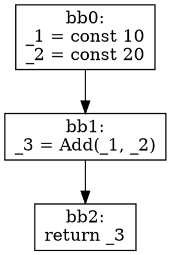

# v0.16.0 IR実装計画と技術選定

**バージョン**: v0.16.0
**作成日**: 2025-11-13
**ステータス**: 計画中
**目標**: コンパイラの中間表現（IR）を設計・実装する

---

## 概要

v0.16.0では、Cb言語のネイティブコンパイラ実装の基盤となる中間表現（IR）を設計・実装します。このバージョンはコンパイラ開発の大きな節目であり、大規模なリファクタリングを含みます。

**主要成果物**:
- HIR (High-level IR) - 高レベル中間表現
- MIR (Mid-level IR) - 中レベル中間表現
- LIR (Low-level IR) - 低レベル中間表現
- IRビューワーとデバッグツール
- データフロー解析基盤

---

## 技術選定

### 1. IR設計アプローチ

**選定**: Rust風の3層IR構造を採用

**理由**:
- HIR/MIR/LIRの3層構造は、各レベルで異なる最適化と解析を可能にする
- Rustコンパイラ（rustc）で実績のある設計
- 段階的な変換により、各ステップでのデバッグが容易

**層の責務**:
```
AST → HIR → MIR → LIR → Assembly
       ↑      ↑      ↑
      型解決  最適化  コード生成
```

#### HIR (High-level IR)
- **目的**: ASTに型情報とスコープ情報を付加した表現
- **特徴**:
  - 制御フロー構造を保持（if/while/for等）
  - 完全な型情報
  - シンボルテーブルとの統合
  - ジェネリクスの単相化（Monomorphization）

#### MIR (Mid-level IR)
- **目的**: 最適化に適した中レベル表現
- **特徴**:
  - SSA形式（Static Single Assignment）
  - 制御フローグラフ（CFG）
  - 基本ブロック（Basic Blocks）
  - データフロー解析に適した形式

#### LIR (Low-level IR)
- **目的**: ターゲット非依存の低レベル命令表現
- **特徴**:
  - 3アドレスコード形式
  - レジスタ割り当て準備
  - 呼び出し規約の適用
  - アセンブリ生成に近い形式

---

### 2. SSA形式の実装

**選定**: MIRレベルでSSA（Static Single Assignment）形式を採用

**SSA形式の利点**:
- データフロー解析が単純化される
- 最適化が容易（定数伝播、デッドコード除去等）
- 使用-定義チェーンが明確

**実装方法**:
```cpp
// SSA形式の例（擬似コード）
// オリジナル:
//   x = 1;
//   x = x + 2;
//   y = x * 3;
//
// SSA形式:
//   x_0 = 1;
//   x_1 = x_0 + 2;
//   y_0 = x_1 * 3;
```

**PHIノードの実装**:
```cpp
// 制御フロー合流点でのPHIノード
// if (cond) {
//   x = 1;     // x_1
// } else {
//   x = 2;     // x_2
// }
// use(x);      // x_3 = PHI(x_1, x_2)
```

**アルゴリズム**:
- 標準的なSSA構築アルゴリズムを使用
- 支配境界（Dominance Frontier）の計算
- PHIノード挿入位置の決定
- 変数のリネーミング

---

### 3. データ構造とメモリ管理

**選定**: C++17/20の機能を最大限活用

#### 使用する主要なC++機能

**1. スマートポインタ**
```cpp
// 所有権が明確な場合
std::unique_ptr<HIRNode> node;

// 共有が必要な場合（型情報など）
std::shared_ptr<TypeInfo> type_info;

// 非所有参照
HIRNode* parent_ref;  // rawポインタで十分
```

**2. std::variant（多態性の代替）**
```cpp
// 仮想関数の代わりにstd::variantを使用（パフォーマンス向上）
using HIRExpr = std::variant<
    HIRLiteral,
    HIRVariable,
    HIRBinaryOp,
    HIRFunctionCall
>;

// パターンマッチング風の処理
std::visit([](auto&& expr) {
    using T = std::decay_t<decltype(expr)>;
    if constexpr (std::is_same_v<T, HIRLiteral>) {
        // リテラルの処理
    } else if constexpr (std::is_same_v<T, HIRBinaryOp>) {
        // 二項演算の処理
    }
}, hir_expr);
```

**3. アリーナアロケータ（パフォーマンス最適化）**
```cpp
// 大量のIRノードを効率的に管理
template<typename T>
class ArenaAllocator {
    std::vector<std::unique_ptr<std::byte[]>> chunks;
    size_t current_offset;

public:
    T* allocate(size_t n);
    void reset();  // 一括解放
};

// 使用例
ArenaAllocator<HIRNode> hir_arena;
HIRNode* node = hir_arena.allocate(1);
```

**メモリ管理戦略**:
- IR構築中はアリーナアロケータを使用（高速化）
- IR最適化パス間ではstd::unique_ptrで所有権を明確化
- 型情報など共有データはstd::shared_ptrで管理

---

### 4. CFG（制御フローグラフ）の表現

**データ構造**:
```cpp
// 基本ブロック（Basic Block）
struct BasicBlock {
    uint32_t id;                              // ブロックID
    std::vector<MIRStatement> statements;     // 命令列
    MIRTerminator terminator;                 // 終端命令
    std::vector<BasicBlock*> predecessors;    // 先行ブロック
    std::vector<BasicBlock*> successors;      // 後続ブロック

    // データフロー解析用
    std::set<uint32_t> live_in;               // 生存変数（入口）
    std::set<uint32_t> live_out;              // 生存変数（出口）
    std::set<uint32_t> def;                   // 定義される変数
    std::set<uint32_t> use;                   // 使用される変数
};

// 制御フローグラフ
struct ControlFlowGraph {
    std::vector<std::unique_ptr<BasicBlock>> blocks;
    BasicBlock* entry_block;                  // エントリーブロック
    BasicBlock* exit_block;                   // 出口ブロック

    // 支配木（Dominator Tree）
    std::unordered_map<BasicBlock*, BasicBlock*> immediate_dominator;
    std::unordered_map<BasicBlock*, std::set<BasicBlock*>> dominance_frontier;

    void build_dominator_tree();
    void compute_dominance_frontier();
};

// 終端命令（Terminator）
struct MIRTerminator {
    enum class Kind {
        Return,           // 関数からの返却
        Goto,             // 無条件ジャンプ
        Branch,           // 条件分岐
        Switch,           // 多方向分岐
        Unreachable,      // 到達不可能
    };

    Kind kind;
    std::optional<MIROperand> condition;      // 条件式（Branch用）
    std::vector<BasicBlock*> targets;         // ジャンプ先
};
```

**CFG構築アルゴリズム**:
1. HIRの制御フロー構造（if/while/for等）を解析
2. 基本ブロックの境界を決定
3. 基本ブロックを生成し、命令を配置
4. エッジ（predecessor/successor）を構築
5. 支配木を計算

---

### 5. HIR設計

#### HIRノード構造
```cpp
// HIR式ノード
struct HIRExpr {
    enum class Kind {
        Literal,          // リテラル
        Variable,         // 変数参照
        BinaryOp,         // 二項演算
        UnaryOp,          // 単項演算
        FunctionCall,     // 関数呼び出し
        MemberAccess,     // メンバーアクセス
        ArrayAccess,      // 配列アクセス
        Cast,             // 型キャスト
        Ternary,          // 三項演算子
    };

    Kind kind;
    TypeInfo type;                            // 型情報（完全に解決済み）
    SourceLocation location;                  // ソースコード位置

    std::variant<
        HIRLiteral,
        HIRVariable,
        HIRBinaryOp,
        HIRUnaryOp,
        HIRFunctionCall,
        HIRMemberAccess,
        HIRArrayAccess,
        HIRCast,
        HIRTernary
    > data;
};

// HIR文ノード
struct HIRStmt {
    enum class Kind {
        VarDecl,          // 変数宣言
        Assignment,       // 代入文
        ExprStmt,         // 式文
        If,               // if文
        While,            // while文
        For,              // for文
        Return,           // return文
        Break,            // break文
        Continue,         // continue文
        Block,            // ブロック
    };

    Kind kind;
    SourceLocation location;

    std::variant<
        HIRVarDecl,
        HIRAssignment,
        HIRExprStmt,
        HIRIf,
        HIRWhile,
        HIRFor,
        HIRReturn,
        HIRBreak,
        HIRContinue,
        HIRBlock
    > data;
};

// HIR関数定義
struct HIRFunction {
    std::string name;                         // 関数名
    std::vector<HIRParam> parameters;         // パラメータ
    TypeInfo return_type;                     // 戻り値型
    std::vector<HIRStmt> body;                // 関数本体
    bool is_generic;                          // ジェネリック関数か
    std::vector<std::string> type_parameters; // 型パラメータ
    SourceLocation location;
};

// HIRプログラム（トップレベル）
struct HIRProgram {
    std::vector<HIRFunction> functions;
    std::vector<HIRStruct> structs;
    std::vector<HIREnum> enums;
    std::vector<HIRInterface> interfaces;
    std::vector<HIRImpl> impls;
    std::unordered_map<std::string, TypeInfo> type_aliases;
};
```

#### ASTからHIRへの変換
```cpp
class HIRGenerator {
public:
    HIRProgram generate(const ASTNode* ast_root);

private:
    HIRExpr lower_expr(const ASTNode* node);
    HIRStmt lower_stmt(const ASTNode* node);
    HIRFunction lower_function(const ASTNode* node);

    // 型解決
    TypeInfo resolve_type(const ASTNode* node);

    // ジェネリクスの単相化
    void monomorphize_generics();

    // スコープ管理
    SymbolTable symbol_table;
    TypeContext type_context;
};
```

---

### 6. MIR設計

#### MIRノード構造
```cpp
// MIR場所（Place）- 左辺値
struct MIRPlace {
    uint32_t local_id;                        // ローカル変数ID
    std::vector<MIRProjection> projections;   // フィールドアクセス、配列アクセス等
};

// MIR右辺値（Rvalue）
struct MIRRvalue {
    enum class Kind {
        Use,              // 値の使用
        BinaryOp,         // 二項演算
        UnaryOp,          // 単項演算
        Ref,              // 参照
        Deref,            // デリファレンス
        Cast,             // キャスト
    };

    Kind kind;
    std::variant<
        MIROperand,
        MIRBinaryOp,
        MIRUnaryOp,
        MIRRef,
        MIRDeref,
        MIRCast
    > data;
};

// MIRオペランド
struct MIROperand {
    enum class Kind {
        Copy,             // コピー
        Move,             // ムーブ
        Constant,         // 定数
    };

    Kind kind;
    std::variant<MIRPlace, MIRConstant> data;
};

// MIR文
struct MIRStatement {
    enum class Kind {
        Assign,           // 代入
        StorageLive,      // ストレージの生存開始
        StorageDead,      // ストレージの生存終了
        Nop,              // 何もしない
    };

    Kind kind;
    std::optional<MIRPlace> place;            // 左辺（Assign用）
    std::optional<MIRRvalue> rvalue;          // 右辺（Assign用）
};

// MIR定数
struct MIRConstant {
    TypeInfo type;
    std::variant<int64_t, double, std::string, bool> value;
};

// MIR関数
struct MIRFunction {
    std::string name;
    std::vector<TypeInfo> parameter_types;
    TypeInfo return_type;
    std::vector<MIRLocal> locals;             // ローカル変数
    ControlFlowGraph cfg;                     // 制御フローグラフ
};

// MIRローカル変数
struct MIRLocal {
    uint32_t id;
    TypeInfo type;
    std::string debug_name;                   // デバッグ用の名前
    bool is_mutable;
};
```

#### HIRからMIRへの変換
```cpp
class MIRGenerator {
public:
    MIRFunction generate(const HIRFunction& hir_func);

private:
    // 制御フローグラフの構築
    ControlFlowGraph build_cfg(const HIRFunction& hir_func);

    // SSA形式への変換
    void convert_to_ssa(MIRFunction& mir_func);

    // 基本ブロックの生成
    BasicBlock* create_basic_block();

    // PHIノードの挿入
    void insert_phi_nodes(ControlFlowGraph& cfg);

    // 変数のリネーミング
    void rename_variables(ControlFlowGraph& cfg);

    // 支配木の構築
    void build_dominator_tree(ControlFlowGraph& cfg);

    // 到達定義解析
    void compute_reaching_definitions(ControlFlowGraph& cfg);

    // 生存変数解析
    void compute_liveness(ControlFlowGraph& cfg);

    std::vector<std::unique_ptr<BasicBlock>> blocks;
    uint32_t next_local_id = 0;
    uint32_t next_block_id = 0;
};
```

---

### 7. LIR設計

#### LIRノード構造
```cpp
// LIR命令
struct LIRInstruction {
    enum class Opcode {
        // データ移動
        Move,             // dst = src
        Load,             // dst = *addr
        Store,            // *addr = src

        // 算術演算
        Add,              // dst = src1 + src2
        Sub,              // dst = src1 - src2
        Mul,              // dst = src1 * src2
        Div,              // dst = src1 / src2
        Mod,              // dst = src1 % src2

        // 論理演算
        And,              // dst = src1 & src2
        Or,               // dst = src1 | src2
        Xor,              // dst = src1 ^ src2
        Not,              // dst = ~src

        // 比較演算
        Cmp,              // フラグ設定

        // 制御フロー
        Jump,             // 無条件ジャンプ
        JumpIf,           // 条件ジャンプ
        Call,             // 関数呼び出し
        Return,           // 関数からの返却

        // その他
        Nop,              // 何もしない
    };

    Opcode opcode;
    std::vector<LIROperand> operands;
    std::optional<std::string> label;         // ジャンプ先ラベル
};

// LIRオペランド
struct LIROperand {
    enum class Kind {
        Register,         // レジスタ（仮想）
        Immediate,        // 即値
        Memory,           // メモリアドレス
        Label,            // ラベル
    };

    Kind kind;
    std::variant<
        uint32_t,         // レジスタID or 即値
        std::string       // ラベル名
    > data;
    TypeInfo type;
};

// LIR基本ブロック
struct LIRBasicBlock {
    std::string label;
    std::vector<LIRInstruction> instructions;
    std::vector<std::string> successors;      // 後続ブロックのラベル
};

// LIR関数
struct LIRFunction {
    std::string name;
    std::vector<LIRBasicBlock> blocks;
    uint32_t num_virtual_registers;           // 仮想レジスタ数
    uint32_t stack_frame_size;                // スタックフレームサイズ
};
```

#### MIRからLIRへの変換
```cpp
class LIRGenerator {
public:
    LIRFunction generate(const MIRFunction& mir_func);

private:
    // MIR命令をLIR命令に変換
    std::vector<LIRInstruction> lower_statement(const MIRStatement& stmt);
    std::vector<LIRInstruction> lower_terminator(const MIRTerminator& term);

    // オペランドの変換
    LIROperand lower_operand(const MIROperand& operand);
    LIROperand lower_place(const MIRPlace& place);

    // 仮想レジスタの割り当て
    uint32_t allocate_virtual_register();

    uint32_t next_vreg_id = 0;
    std::unordered_map<uint32_t, uint32_t> local_to_vreg;
};
```

---

### 8. データフロー解析基盤

**実装する解析**:

#### 1. 生存変数解析（Liveness Analysis）
```cpp
class LivenessAnalysis {
public:
    void analyze(ControlFlowGraph& cfg);

    // 各基本ブロックのlive_in/live_outを計算
    void compute_liveness(ControlFlowGraph& cfg);

    // 特定の点での生存変数を取得
    std::set<uint32_t> get_live_at(BasicBlock* block, size_t instruction_index);

private:
    // 反復データフロー解析
    void iterate_until_fixed_point(ControlFlowGraph& cfg);
};
```

#### 2. 到達定義解析（Reaching Definitions）
```cpp
class ReachingDefinitions {
public:
    void analyze(ControlFlowGraph& cfg);

    // 各変数の定義がどこまで到達するかを計算
    std::set<uint32_t> get_reaching_defs(BasicBlock* block, uint32_t local_id);

private:
    std::unordered_map<BasicBlock*, std::set<uint32_t>> gen;
    std::unordered_map<BasicBlock*, std::set<uint32_t>> kill;
    std::unordered_map<BasicBlock*, std::set<uint32_t>> in;
    std::unordered_map<BasicBlock*, std::set<uint32_t>> out;
};
```

#### 3. 使用-定義チェーン（Use-Def Chain）
```cpp
class UseDefChain {
public:
    void build(const MIRFunction& func);

    // 変数の定義を取得
    std::vector<MIRStatement*> get_definitions(uint32_t local_id);

    // 変数の使用箇所を取得
    std::vector<MIRStatement*> get_uses(uint32_t local_id);

private:
    std::unordered_map<uint32_t, std::vector<MIRStatement*>> defs;
    std::unordered_map<uint32_t, std::vector<MIRStatement*>> uses;
};
```

#### 4. 支配木（Dominator Tree）
```cpp
class DominatorTree {
public:
    void build(ControlFlowGraph& cfg);

    // ブロックAがブロックBを支配するか
    bool dominates(BasicBlock* a, BasicBlock* b);

    // 即座支配者を取得
    BasicBlock* get_immediate_dominator(BasicBlock* block);

    // 支配境界を取得
    std::set<BasicBlock*> get_dominance_frontier(BasicBlock* block);

private:
    // Lengauer-Tarjanアルゴリズムを使用
    void compute_immediate_dominators(ControlFlowGraph& cfg);
    void compute_dominance_frontier(ControlFlowGraph& cfg);

    std::unordered_map<BasicBlock*, BasicBlock*> idom;
    std::unordered_map<BasicBlock*, std::set<BasicBlock*>> df;
};
```

---

### 9. IRビューワー

#### テキストダンプ形式
```cpp
class IRDumper {
public:
    // HIRのダンプ
    std::string dump_hir(const HIRProgram& program);
    std::string dump_hir_function(const HIRFunction& func);

    // MIRのダンプ
    std::string dump_mir(const MIRFunction& func);
    std::string dump_mir_cfg(const ControlFlowGraph& cfg);

    // LIRのダンプ
    std::string dump_lir(const LIRFunction& func);

    // ファイルへの出力
    void write_to_file(const std::string& filename, const std::string& content);
};
```

**出力例（MIR）**:
```
fn main() -> int {
    let mut _0: int;    // return value
    let mut _1: int;    // x
    let mut _2: int;    // y
    let mut _3: int;    // temp

    bb0: {
        _1 = const 10;
        _2 = const 20;
        _3 = Add(_1, _2);
        _0 = _3;
        return;
    }
}
```

#### GraphViz可視化
```cpp
class GraphVizGenerator {
public:
    // CFGをGraphViz形式で出力
    std::string generate_cfg_dot(const ControlFlowGraph& cfg);

    // 支配木をGraphViz形式で出力
    std::string generate_domtree_dot(const DominatorTree& domtree);

    // ファイルへの出力とPNG生成
    void export_png(const std::string& dot_content, const std::string& output_file);
};
```

**出力例（DOT形式）**:


---

### 10. テストフレームワーク

**テスト戦略**:
```cpp
// tests/unit/ir/test_hir_generation.cpp
TEST(HIRGeneration, SimpleFunctionLowering) {
    // ASTノードを構築
    auto ast = parse("fn add(x: int, y: int) -> int { return x + y; }");

    // HIR生成
    HIRGenerator generator;
    HIRProgram hir = generator.generate(ast.get());

    // HIR検証
    ASSERT_EQ(hir.functions.size(), 1);
    ASSERT_EQ(hir.functions[0].name, "add");
    ASSERT_EQ(hir.functions[0].parameters.size(), 2);
    ASSERT_EQ(hir.functions[0].return_type, TYPE_INT);
}

// tests/unit/ir/test_mir_generation.cpp
TEST(MIRGeneration, SSAConversion) {
    // HIR関数を構築
    HIRFunction hir_func = create_test_function();

    // MIR生成
    MIRGenerator generator;
    MIRFunction mir_func = generator.generate(hir_func);

    // SSA形式の検証
    verify_ssa_properties(mir_func);
}

// tests/unit/ir/test_cfg_construction.cpp
TEST(CFGConstruction, IfStatement) {
    // HIR if文を構築
    HIRFunction hir_func = create_if_statement();

    // CFG構築
    MIRGenerator generator;
    MIRFunction mir_func = generator.generate(hir_func);

    // CFG検証
    ASSERT_EQ(mir_func.cfg.blocks.size(), 4);  // entry, then, else, merge
    ASSERT_TRUE(has_edge(bb0, bb1));
    ASSERT_TRUE(has_edge(bb0, bb2));
    ASSERT_TRUE(has_edge(bb1, bb3));
    ASSERT_TRUE(has_edge(bb2, bb3));
}

// tests/integration/ir/test_ir_roundtrip.cpp
TEST(IRIntegration, RoundTripTest) {
    // ソースコードをパース
    auto ast = parse_file("tests/cases/ir/simple_function.cb");

    // AST -> HIR -> MIR -> LIR
    HIRProgram hir = generate_hir(ast.get());
    std::vector<MIRFunction> mir = generate_mir(hir);
    std::vector<LIRFunction> lir = generate_lir(mir);

    // 各段階でのダンプを検証
    verify_hir_dump(hir, "tests/expected/simple_function.hir");
    verify_mir_dump(mir, "tests/expected/simple_function.mir");
    verify_lir_dump(lir, "tests/expected/simple_function.lir");
}
```

**ベンチマークテスト**:
```cpp
// tests/benchmark/ir_generation_bench.cpp
BENCHMARK(HIRGeneration) {
    auto ast = parse_large_file("tests/benchmark/large.cb");
    HIRGenerator generator;
    benchmark::DoNotOptimize(generator.generate(ast.get()));
}

BENCHMARK(MIRGeneration) {
    HIRFunction hir_func = load_test_hir();
    MIRGenerator generator;
    benchmark::DoNotOptimize(generator.generate(hir_func));
}
```

---

## プロジェクト構造のリファクタリング

### 新しいディレクトリ構造
```
src/
├── frontend/
│   ├── recursive_parser/
│   ├── preprocessor/
│   └── ...
├── backend/
│   ├── ir/
│   │   ├── hir/
│   │   │   ├── hir_node.h
│   │   │   ├── hir_node.cpp
│   │   │   ├── hir_generator.h
│   │   │   ├── hir_generator.cpp
│   │   │   ├── hir_visitor.h
│   │   │   └── hir_dumper.cpp
│   │   ├── mir/
│   │   │   ├── mir_node.h
│   │   │   ├── mir_node.cpp
│   │   │   ├── mir_generator.h
│   │   │   ├── mir_generator.cpp
│   │   │   ├── cfg.h
│   │   │   ├── cfg.cpp
│   │   │   ├── ssa_builder.h
│   │   │   ├── ssa_builder.cpp
│   │   │   ├── dominator_tree.h
│   │   │   ├── dominator_tree.cpp
│   │   │   └── mir_dumper.cpp
│   │   ├── lir/
│   │   │   ├── lir_node.h
│   │   │   ├── lir_node.cpp
│   │   │   ├── lir_generator.h
│   │   │   ├── lir_generator.cpp
│   │   │   └── lir_dumper.cpp
│   │   └── analysis/
│   │       ├── liveness.h
│   │       ├── liveness.cpp
│   │       ├── reaching_defs.h
│   │       ├── reaching_defs.cpp
│   │       ├── use_def_chain.h
│   │       └── use_def_chain.cpp
│   ├── optimizer/     （v0.17.0で実装）
│   ├── codegen/       （v0.18.0で実装）
│   └── interpreter/   （既存）
├── common/
│   ├── ast.h
│   ├── type_system.h
│   └── ...
└── platform/
    └── ...

tests/
├── unit/
│   └── ir/
│       ├── test_hir_generation.cpp
│       ├── test_mir_generation.cpp
│       ├── test_lir_generation.cpp
│       ├── test_cfg_construction.cpp
│       ├── test_ssa_construction.cpp
│       └── test_dataflow_analysis.cpp
├── integration/
│   └── ir/
│       ├── test_ir_roundtrip.cpp
│       └── test_ir_dump.cpp
└── cases/
    └── ir/
        ├── simple_function.cb
        ├── control_flow.cb
        ├── nested_loops.cb
        └── generics.cb
```

### Makefileの更新
```makefile
# IR関連のディレクトリ
IR_DIR=$(BACKEND_DIR)/ir
HIR_DIR=$(IR_DIR)/hir
MIR_DIR=$(IR_DIR)/mir
LIR_DIR=$(IR_DIR)/lir
ANALYSIS_DIR=$(IR_DIR)/analysis

# IRオブジェクトファイル
HIR_OBJS = \
    $(HIR_DIR)/hir_node.o \
    $(HIR_DIR)/hir_generator.o \
    $(HIR_DIR)/hir_dumper.o

MIR_OBJS = \
    $(MIR_DIR)/mir_node.o \
    $(MIR_DIR)/mir_generator.o \
    $(MIR_DIR)/cfg.o \
    $(MIR_DIR)/ssa_builder.o \
    $(MIR_DIR)/dominator_tree.o \
    $(MIR_DIR)/mir_dumper.o

LIR_OBJS = \
    $(LIR_DIR)/lir_node.o \
    $(LIR_DIR)/lir_generator.o \
    $(LIR_DIR)/lir_dumper.o

ANALYSIS_OBJS = \
    $(ANALYSIS_DIR)/liveness.o \
    $(ANALYSIS_DIR)/reaching_defs.o \
    $(ANALYSIS_DIR)/use_def_chain.o

IR_OBJS = $(HIR_OBJS) $(MIR_OBJS) $(LIR_OBJS) $(ANALYSIS_OBJS)

# 新しいテストターゲット
ir-test: $(TESTS_DIR)/unit/ir/test_main
    @echo "Running IR unit tests..."
    @cd tests/unit/ir && ./test_main
```

---

## 実装フェーズ

### Phase 1: HIR実装（3週間）

**Week 1: HIR基本構造**
- [ ] HIRノード定義（hir_node.h/cpp）
- [ ] ASTからHIRへの基本的な変換
- [ ] シンプルな式・文の変換
- [ ] 型情報の保持

**Week 2: HIR高度な機能**
- [ ] 制御フロー（if/while/for）の変換
- [ ] 関数定義・呼び出しの変換
- [ ] 構造体・enum・interfaceの変換
- [ ] スコープ管理とシンボルテーブルの統合

**Week 3: HIRジェネリクス対応**
- [ ] ジェネリック関数の変換
- [ ] ジェネリック構造体の変換
- [ ] 型パラメータの解決
- [ ] 単相化（Monomorphization）の実装
- [ ] HIRダンプ機能
- [ ] HIRユニットテスト（30テスト）

### Phase 2: MIR実装（4週間）

**Week 1: MIR基本構造とCFG**
- [ ] MIRノード定義（mir_node.h/cpp）
- [ ] 基本ブロック構造の実装
- [ ] CFG（制御フローグラフ）の構築
- [ ] HIRからMIRへの基本的な変換

**Week 2: SSA形式の実装**
- [ ] 支配木の構築（dominator_tree.h/cpp）
- [ ] 支配境界の計算
- [ ] PHIノードの挿入
- [ ] 変数のリネーミング
- [ ] SSA形式への変換完成

**Week 3: データフロー解析**
- [ ] 生存変数解析（liveness.h/cpp）
- [ ] 到達定義解析（reaching_defs.h/cpp）
- [ ] 使用-定義チェーン（use_def_chain.h/cpp）
- [ ] def/useセットの計算

**Week 4: MIR完成とテスト**
- [ ] MIRダンプ機能
- [ ] GraphViz可視化
- [ ] MIRユニットテスト（40テスト）
- [ ] データフロー解析のテスト

### Phase 3: LIR実装（3週間）

**Week 1: LIR基本構造**
- [ ] LIRノード定義（lir_node.h/cpp）
- [ ] 3アドレスコード形式の実装
- [ ] 仮想レジスタの管理
- [ ] MIRからLIRへの基本的な変換

**Week 2: LIR命令選択**
- [ ] 算術演算の変換
- [ ] メモリアクセスの変換
- [ ] 制御フロー命令の変換
- [ ] 関数呼び出しの変換

**Week 3: LIR完成とテスト**
- [ ] LIRダンプ機能
- [ ] LIRユニットテスト（30テスト）
- [ ] 統合テスト（AST->HIR->MIR->LIR）

### Phase 4: IRビューワーとツール（2週間）

**Week 1: デバッグツール**
- [ ] HIR/MIR/LIRダンプ機能の完成
- [ ] GraphViz可視化ツール
- [ ] CFG可視化
- [ ] 支配木可視化

**Week 2: 統合とドキュメント**
- [ ] コマンドラインオプションの実装（`--dump-hir`, `--dump-mir`, `--dump-lir`）
- [ ] IR設計ドキュメントの完成
- [ ] 使用方法ドキュメント
- [ ] サンプルコードと期待される出力

---

## コマンドラインインターフェース

### 新しいコンパイラオプション
```bash
# HIRダンプ
./main example.cb --dump-hir

# MIRダンプ（CFG付き）
./main example.cb --dump-mir --dump-cfg

# LIRダンプ
./main example.cb --dump-lir

# GraphViz可視化
./main example.cb --emit-cfg-dot > output.dot
dot -Tpng output.dot -o output.png

# 全てのIRレベルをダンプ
./main example.cb --dump-all-ir

# IRレベルまで実行して停止
./main example.cb --stop-at=hir
./main example.cb --stop-at=mir
./main example.cb --stop-at=lir
```

---

## エラーハンドリング

### IR生成時のエラー処理
```cpp
class IRError {
public:
    enum class Kind {
        TypeError,         // 型エラー
        UndefinedSymbol,   // 未定義シンボル
        InvalidConversion, // 無効な変換
        SSAViolation,      // SSA形式違反
        CFGError,          // CFG構築エラー
    };

    Kind kind;
    std::string message;
    SourceLocation location;

    std::string to_string() const;
};

class IRErrorReporter {
public:
    void report_error(const IRError& error);
    void report_warning(const IRError& warning);

    bool has_errors() const { return !errors.empty(); }
    size_t error_count() const { return errors.size(); }

    void print_all_errors(std::ostream& out);

private:
    std::vector<IRError> errors;
    std::vector<IRError> warnings;
};
```

---

## パフォーマンス目標

### ベンチマーク
- **HIR生成**: 1000行のコードを100ms以内で処理
- **MIR生成**: HIRから50ms以内で変換
- **LIR生成**: MIRから30ms以内で変換
- **メモリ使用量**: 1000行のコードで50MB以内

### プロファイリング
```bash
# パフォーマンス測定
./main large_program.cb --benchmark

# メモリプロファイリング
valgrind --tool=massif ./main large_program.cb --dump-mir

# CPU プロファイリング
perf record ./main large_program.cb --dump-mir
perf report
```

---

## 成果物チェックリスト

### コード
- [ ] HIR実装（hir/*.h, hir/*.cpp）
- [ ] MIR実装（mir/*.h, mir/*.cpp）
- [ ] LIR実装（lir/*.h, lir/*.cpp）
- [ ] データフロー解析（analysis/*.h, analysis/*.cpp）
- [ ] IRダンプ機能
- [ ] GraphViz可視化

### テスト
- [ ] HIRユニットテスト（30テスト）
- [ ] MIRユニットテスト（40テスト）
- [ ] LIRユニットテスト（30テスト）
- [ ] 統合テスト（20テスト）
- [ ] ベンチマークテスト

### ドキュメント
- [ ] IR設計ドキュメント
- [ ] API リファレンス
- [ ] 使用方法ガイド
- [ ] サンプルコードと出力例

### ツール
- [ ] IRダンプコマンド
- [ ] CFG可視化ツール
- [ ] IR検証ツール

---

## リスクと対策

### リスク1: SSA構築の複雑性
**対策**:
- 標準的なアルゴリズムを使用（Cytron et al.の論文）
- 段階的な実装（まず単純なケースから）
- 豊富なテストケース

### リスク2: パフォーマンス問題
**対策**:
- アリーナアロケータの活用
- プロファイリングによるボトルネック特定
- 最適化を段階的に適用

### リスク3: 実装期間の延長
**対策**:
- 各フェーズでの明確なマイルストーン
- 最小限の機能から実装
- 並行作業の可能性を検討

---

## 次のバージョンへの準備（v0.17.0）

v0.16.0のIR実装により、v0.17.0での最適化実装の基盤が整います：

**準備完了する項目**:
- [ ] MIR上での最適化パス実行基盤
- [ ] データフロー解析の結果
- [ ] SSA形式による最適化の容易化
- [ ] パスマネージャーの設計方針

**v0.17.0で実装予定の最適化**:
- 定数畳み込み（Constant Folding）
- 定数伝播（Constant Propagation）
- デッドコード除去（Dead Code Elimination）
- 共通部分式除去（Common Subexpression Elimination）
- 強度削減（Strength Reduction）
- ループ不変式の移動（Loop-Invariant Code Motion）

---

## まとめ

v0.16.0では、Cb言語のネイティブコンパイラ実装の基盤となる3層IR構造（HIR/MIR/LIR）を設計・実装します。これにより：

1. **型情報の完全な解決**（HIR）
2. **最適化に適した表現**（MIR）
3. **コード生成への準備**（LIR）

が実現され、v0.17.0以降の最適化とコード生成の実装が可能になります。

**実装期間**: 3-4ヶ月
**開始予定**: v0.15.0完了後
**完了目標**: 2025年Q2-Q3
